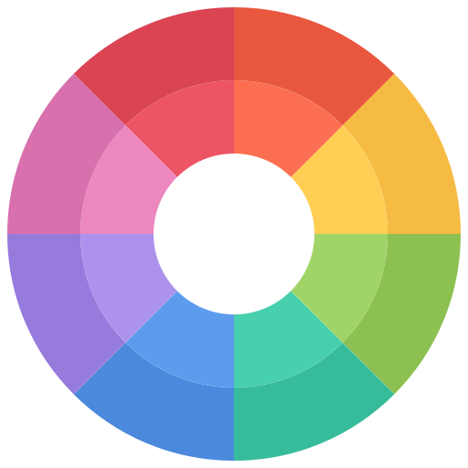
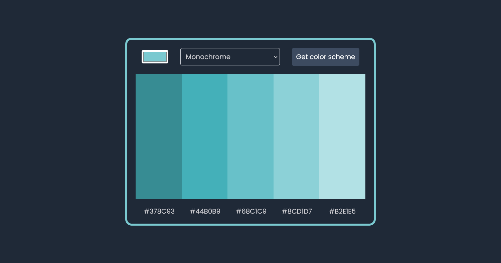

#  QuikColor

QuikColor is a color scheme generator allowing the user to effortlessly create stunning color schemes from a single color. Powered by [The Color API](https://www.thecolorapi.com/), it provides monochrome, analogic, complement, triad, and quad color schemes in an instant.

### Screenshot

### Link

- Live Site URL: [Netlify](https://quikcolor.netlify.app)

### Built with

- HTML
- CSS
- JavaScript

### Acknowledgments

[The Color API](https://www.thecolorapi.com/)
